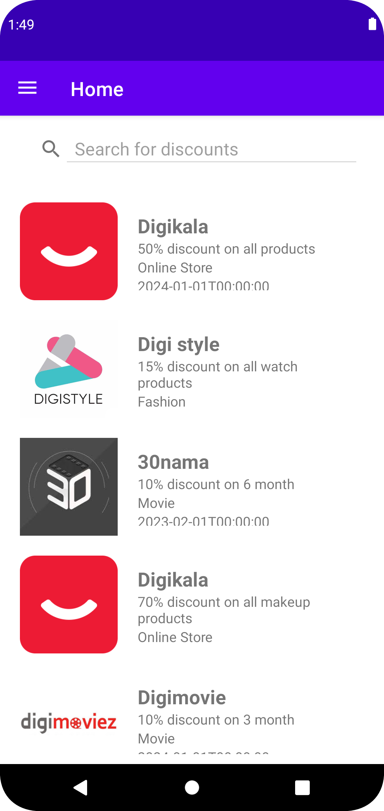
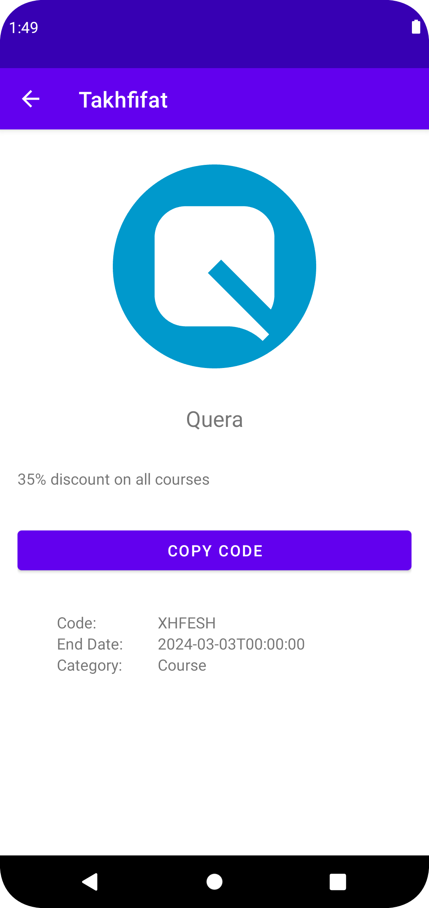
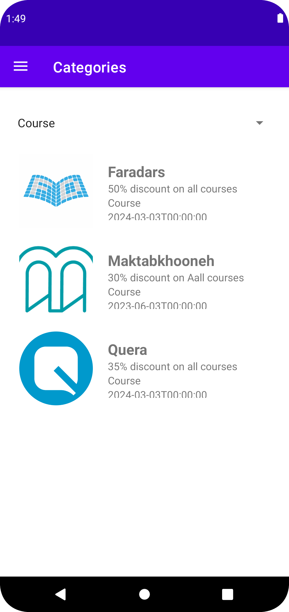
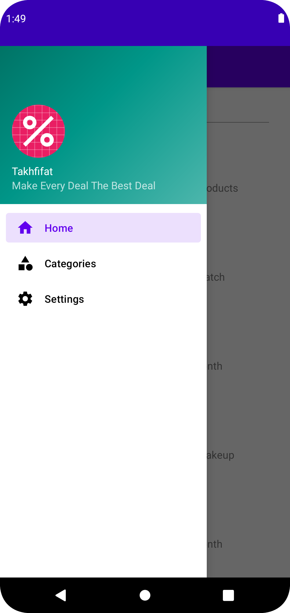
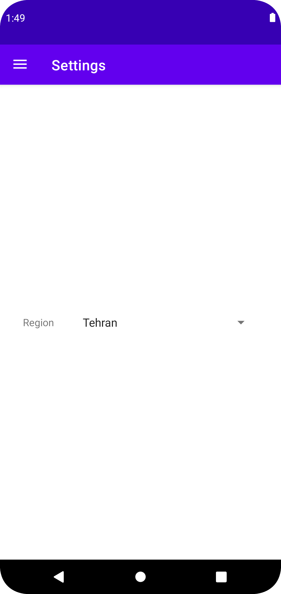

# Takhfifat
Sharif University of Technology Mobile Programming Course Final Project

**Parsa Mohammadian - 98102284**

**Sara Azarnoush - 98170668**

Fall 2022

## Description
Takhfifat is a mobile application that helps users to find the best deals in their city.
It is a platform that accumulates the best discounts and deals from different stores and restaurants in a city and presents them to the users in a simple and easy way.

## Features
- Users can browse the deals and discounts in their city.
- Users can search for deals and discounts by name.
- Users can filter deals and discounts by category.
- Users can see the details of a deal or discount.
- Users can open the store's website to see more details about the deal or discount.
- Users can copy the coupon code of a deal or discount to clipboard.

## Screenshots
. | . | .
:-:|:-:|:-:
 |  | 
 |  | 

## Technical Details
The application is written in Java and uses the following libraries:
- [Volley](https://developer.android.com/training/volley)
- [Gsone](https://github.com/google/gson)
- [Picasso](https://square.github.io/picasso/)

The application uses a RESTful API to fetch data from the [backend server](https://github.com/parsa2820/mobile-project-backend).